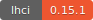
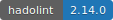

# My Personal Site

[🇷🇺 Русская версия](./README_RU.md)

| Category | Technologies |
|----------|--------------|
| Coverage |   |
| Backend |         |
| Database |    |
| Cache |  |
| Frontend |    |
| Testing |     |
| DevOps |     |
| Quality |           |
| Logging |    |
| Architecture |   |
| Tools |     |
| CI/CD |   |

> [!NOTE]
> Backend coverage — pytest (Python). Frontend coverage — Jest (TypeScript). Both generated in separate CI jobs.

A personal knowledge site with portfolio and case-study pages, a competency matrix, localized articles,
and an integrated content authoring mode.

## 📖 Documentation

- [Project idea](../docs/idea.md)  
- [Project TODOs](../docs/TODO.md)

## 📂 Project Structure

```
my-site/
├── infra/          # nginx reverse proxy, run scripts
├── frontend/       # Angular 22 hybrid SSR/CSR (served by its own Node.js image)
├── backend/        # Litestar API + domain logic
│   ├── src/        # Application source
│   ├── tests/      # Backend tests (pytest)
│   └── performance/ # Locust load-test scenarios and reports
├── .env.example    # Example environment variables
├── .env.test       # Safe test-only environment variables
├── docker-compose.test.yml
└── docker-compose.yml
```

## ✨ Features

- Competency matrix with localized sheets and sections, search, a grid/table view, detailed Q&A, public SEO question pages, and linked resources
- Articles with localized RU/EN content, folders, tags, search, date/tag filters, publish visibility, and SSR public article pages
- Integrated moderator/admin mode for creating, editing, publishing, and unpublishing articles and matrix questions
- Privacy-safe article analytics with public view counters, engaged views, source categories, and anonymous reactions
- Public "how this site is built" case-study page covering architecture, quality, and operations
- Russian/English UI and content localization driven by the backend
- PASETO-protected moderator/admin authentication

## 🚀 Quick Start

1. Clone the repository:
```bash
git clone git@github.com:ALittleMoron/my-site.git
cd my-site
```

2. Create `.env` file:
```bash
cp .env.example .env
```

3. Create certs for `nginx` (optional for local development):

```bash
mkcert -install
mkcert \
  <your-domain> \
  s3.<your-domain>
mv <your-domain>.pem ./infra/nginx/certs/
mv <your-domain>-key.pem ./infra/nginx/certs/
```

The nginx container runs as UID/GID `101:101`, so mounted certificate and private key files
must be readable by that user. For local `mkcert` files, `chmod 644 ./infra/nginx/certs/<file>`
is enough; for production, prefer owner/group permissions that grant read access only to nginx.

4. Update `.env` with your values.

5. Run via `Makefile`:
```bash
make run
```

`make run` validates the required `.env` values before Compose starts services. It brings
PostgreSQL, Valkey, MinIO, Databasus, backend, frontend, and nginx up through Docker
health checks, runs one-shot backend initialization, and switches public traffic between
blue/green backend/frontend slots with a graceful nginx reload.

## ⚙️ Endpoints

- Frontend: `http://localhost`
- API: `http://localhost/api`
- API liveness: `http://localhost/api/healthcheck`
- API readiness: `http://localhost/api/healthcheck/ready`
- API docs: `http://localhost/api/docs`
- OpenAPI spec: `http://localhost/api/docs/openapi.json`

Internal web panels are available only through host-level WireGuard and nginx
ports bound to `VPN_BIND_ADDRESS`:

- MinIO Console: `http://<VPN_BIND_ADDRESS>:18081`
- Databasus: `http://<VPN_BIND_ADDRESS>:18082`

The production public firewall baseline is `80/tcp`, `443/tcp`, and the chosen
WireGuard UDP port. See [WireGuard internal access](../docs/wireguard-internal-access.md).

See [docker-compose.yml](../docker-compose.yml) for all services.

## 🧪 Tests

```bash
make tests-compose              # starts/reuses test DB, backend + frontend, owned cleanup
make tests-fast                 # backend + frontend; starts/reuses test DB automatically
make test-env-up                # start reusable test PostgreSQL
make test-env-down              # stop reusable test PostgreSQL and remove data
make test-backend-unit          # backend unit tests, no DB required
make test-backend-integration   # backend integration tests, auto test DB
make test-frontend              # frontend only (jest)
make -C frontend ssr-smoke      # production SSR build + public article, case-study, and matrix question HTML smoke
make performance-smoke          # auto local backend + seeded short Locust smoke profile
make performance-lighthouse     # production Angular SSR build + strict Lighthouse CI quality/performance gates
make query-plans-balanced       # auto test DB, storage-wide SQL capture + EXPLAIN ANALYZE gate
```
