# My Personal Site 

[🇷🇺 Русская версия](./README_RU.md)

| Category | Technologies |
|----------|--------------|
| Coverage |  |
| Backend | 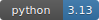   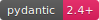 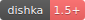  |
| Database | 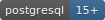 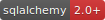 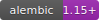 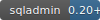 |
| Frontend |  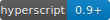 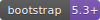 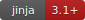 |
| DevOps | 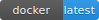 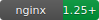  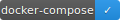 |
| Quality |      |
| Logging |  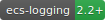 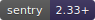 |
| Architecture | 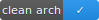 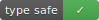 |
| Tools |  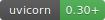 |
| CI/CD |  |

> [!WARNING]
> Coverage shows cover percents of entire project. That means, some parts of projects are not
> covered yet, but it does not mean, that it is bad. For example, there is no coverage of endpoints
> of templates (HTMX + HyperScript) or CLI. CLI I tested manually, frontend not tested yet. But
> I will separate frontend and backend further.

A web application with a Litestar as backend with HTMX as frontend (Server Side Rendering). 
My site with blog, mentoring things and others.

## 📖 Documentation

- [Project idea](../docs/idea.md)  
- [Project vision](../docs/vision.md) 
- [Domain entities](../docs/domain.md)
- [ADR folder](../docs/adr/)

## 📂 Project Structure

```
my-site/
├── docker/       # Docker configuration files (scripts, Dockerfile, nginx conf, etc.)
├── src/          # Source code
├── tests/        # Project autotests
├── .env.example  # Example of project envs
├── ...
└── README.md     # Project readme (current file)
```

## ✨ Features

- Competency matrix with questions and answers
- Simple dynamic frontend using HTMX
- API with documentation
- Dark theme UI

## 🚀 Quick Start

1. Clone the repository:
```bash
git clone git@github.com:ALittleMoron/my-site.git
cd my-site
```

2. Make `.env` file
```bash
cp .env.example .env
```

3. Create your certs for `nginx` (optional for local development)

```bash
mkcert -install
mkcert \
  <your-domain> \
  s3.<your-domain> \
  s3-panel.<your-domain> \
  backup.<your-domain>
mv <your-domain>.pem ./docker/nginx/certs/
mv <your-domain>-key.pem ./docker/nginx/certs/
```

4. Change `.env` file variables to yours

5. Run docker compose via `Makefile`
```bash
make run
```

6. Or run local app

```bash
make start_local
```

## ⚙️ Endpoints

- Frontend runs on `http://localhost`
- API runs on `http://localhost/api`
- API documentation available at `http://localhost/api/docs`
- OpenAPI specification available at `http://localhost/api/docs/openapi.json`

For other routes see [docker-compose.yaml](../docker-compose.yml)

