# Мой личный сайт

[🇺🇸 English version](./README.md)

| Категория | Технологии |
|----------|------------|
| Покрытие |   |
| Backend | 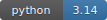    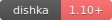 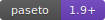 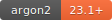 |
| База данных | 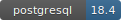 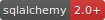 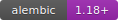 |
| Кэш | 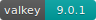 |
| Frontend | 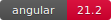 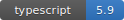 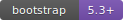 |
| Тестирование | 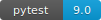 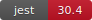 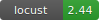 |
| DevOps | 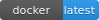 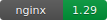  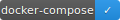 |
| Качество |  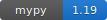 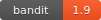 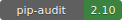   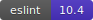 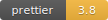 |
| Логирование |  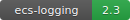 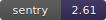 |
| Архитектура | 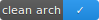 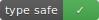 |
| Инструменты | 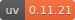 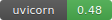 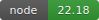 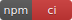 |
| CI/CD | 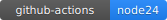 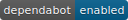 |

> [!NOTE]
> Backend coverage — pytest (Python). Frontend coverage — Jest (TypeScript). Оба генерируются в отдельных CI job-ах.

Личный сайт-база знаний с портфолио, матрицей компетенций, локализованными заметками
и встроенным режимом редактирования контента.

## 📖 Документация

- [Идея проекта](../docs/idea.md)  
- [Что нужно сделать](../docs/TODO.md)

## 📂 Структура проекта

```
my-site/
├── infra/          # nginx reverse proxy, скрипты запуска
├── frontend/       # Angular 21 hybrid SSR/CSR (собственный Node.js-образ)
├── backend/        # Litestar API + доменная логика
│   ├── src/        # Исходный код приложения
│   ├── tests/      # Backend-тесты (pytest)
│   └── performance/ # сценарии нагрузочного тестирования Locust и отчёты
├── .env.example    # Пример переменных окружения
├── .env.test       # Безопасные переменные для тестового окружения
├── docker-compose.test.yml
└── docker-compose.yml
```

## ✨ Возможности

- Матрица компетенций: локализованные листы и разделы, поиск, список/таблица, детальные ответы, публичные SEO-страницы вопросов и внешние ресурсы
- Заметки: RU/EN-контент, папки, теги, поиск, фильтры по датам/тегам, управление публикацией и SSR-страницы публичных статей
- Встроенный режим модератора/администратора: создание, редактирование, публикация и снятие с публикации заметок и вопросов матрицы
- Приватная аналитика заметок: публичные счётчики просмотров, вовлечённые просмотры, категории источников и анонимные реакции
- Локализация интерфейса и контента на русском и английском языках
- PASETO-аутентификация для защищённого режима модератора/администратора

## 🚀 Запуск

1. Клонировать репозиторий:
```bash
git clone git@github.com:ALittleMoron/my-site.git
cd my-site
```

2. Создать файл `.env`:
```bash
cp .env.example .env
```

3. Сгенерировать сертификаты для `nginx` (опционально для локального запуска):

```bash
mkcert -install
mkcert \
  <your-domain> \
  s3.<your-domain> \
  s3-panel.<your-domain> \
  backup.<your-domain>
mv <your-domain>.pem ./infra/nginx/certs/
mv <your-domain>-key.pem ./infra/nginx/certs/
```

Контейнер nginx запускается с UID/GID `101:101`, поэтому смонтированные сертификат и
приватный ключ должны быть читаемы этим пользователем. Для локальных файлов `mkcert`
достаточно `chmod 644 ./infra/nginx/certs/<file>`; для production лучше настроить
owner/group-права так, чтобы доступ на чтение был только у nginx.

4. Обновить переменные в `.env`.

5. Запустить через `Makefile`:
```bash
make run
```

## ⚙️ Важные ссылки

- Frontend: `http://localhost`
- API: `http://localhost/api`
- Документация API: `http://localhost/api/docs`
- OpenAPI спецификация: `http://localhost/api/docs/openapi.json`

Другие сервисы — в [docker-compose.yml](../docker-compose.yml).

## 🧪 Тесты

```bash
make tests-compose              # запустить/переиспользовать test DB, backend + frontend, очистить своё
make tests-fast                 # backend + frontend; test DB готовится автоматически
make test-env-up                # запустить переиспользуемый test PostgreSQL
make test-env-down              # остановить test PostgreSQL и удалить данные
make test-backend-unit          # unit-тесты backend, DB не нужна
make test-backend-integration   # интеграционные тесты backend, test DB готовится автоматически
make test-frontend              # только frontend (jest)
make -C frontend ssr-smoke      # production SSR build + smoke HTML публичной статьи и вопроса матрицы
make performance-smoke          # автоматический local backend + короткий Locust smoke-профиль
make query-plans-balanced       # автоматическая test DB, seed data и EXPLAIN ANALYZE search-запросов
```
