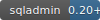
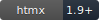
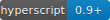
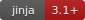

# Мой личный сайт

[🇺🇸 English version](./README.md)

| Категория | Технологии |
|----------|------------|
| Покрытие |  |
| Backend |       |
| База данных |     |
| Frontend |     |
| DevOps |     |
| Качество |      |
| Логирование |    |
| Архитектура |   |
| Инструменты |   |
| CI/CD |  |

> [!WARNING]
> Значок coverage показывает процент покрытия всего проекта.  
> Нужно иметь в виду, что если процент низкий, то это не значит, что проект покрыт слабо, а
> следовательно плохо написан. Я пока не писал тесты на фронтенд, а он является весомой частью
> проекта, правда протестировать его получится только каким-нибудь selenium. Когда я перепишу фронт
> с HTMX + HyperScript на какой-нибудь модный frontend-framework, тогда coverage backend-части
> вырастет весомо. Так и с некоторыми другими частями проекта. Core функционал протестирован на 95+
> процентов.

Веб-приложение с **Litestar** в качестве backend и **HTMX** в качестве frontend (Server Side
Rendering). Мой сайт с блогом, матрицей компетенций, материалами по менторству и другими вещами.

## 📖 Документация

- [Идея проекта](../docs/idea.md)  
- [Техническое видение](../docs/vision.md)
- [Доменные сущности](../docs/domain.md)
- [Папка со всеми ADR](../docs/adr/)

## 📂 Структура проекта

```
my-site/
├── infra/ # Файлы конфигурации инфраструктуры (скрипты, Dockerfile, конфиги nginx и др.)
├── src/ # Исходный код
├── backend_tests/ # Автотесты проекта
├── .env.example # Пример файла окружения
├── ...
└── README.md # Этот файл
```

## ✨ Возможности

- Матрица компетенций с вопросами и ответами  
- Простой динамический фронтенд на HTMX  
- API с документацией  
- Тёмная тема интерфейса  

## 🚀 Запуск

1. Клонировать репозиторий:
```bash
git clone git@github.com:ALittleMoron/my-site.git
cd my-site
```

2. Создать файл `.env`:
```bash
cp .env.example .env
```

3. Сгенерируйте сертификаты для `nginx` (опционально для локального запуска)

```bash
mkcert -install
mkcert \
  <your-domain> \
  s3.<your-domain> \
  s3-panel.<your-domain> \
  backup.<your-domain>
mv <your-domain>.pem ./infra/nginx/certs/
mv <your-domain>-key.pem ./infra/nginx/certs/
```

4. Изменить переменные в `.env` под свои значения

5. Запустите docker-compose через `Makefile`
```bash
make run
```

6. Или запустите локально через `uvicorn`

```bash
make start_local
```


## ⚙️ Важные ссылки

- Frontend: `http://localhost`
- API: `http://localhost/api`
- Документация API: `http://localhost/api/docs`
- OpenAPI спецификация: `http://localhost/api/docs/openapi.json`

Другие ссылки см. в [docker-compose.yaml](../docker-compose.yml)

