# My Personal Site 

[🇷🇺 Русская версия](./README_RU.md)

| Category | Technologies |
|----------|--------------|
| Coverage |  |
| Backend | 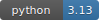   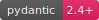 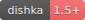 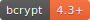 |
| Database | 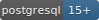 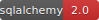 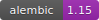 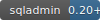 |
| Frontend | 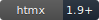 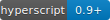 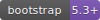 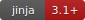 |
| DevOps | 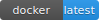 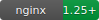  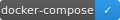 |
| Quality |  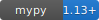 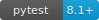  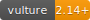 |
| Logging | 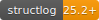 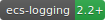  |
| Architecture | 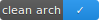 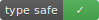 |
| Tools | 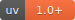 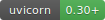 |
| CI/CD |  |

> [!WARNING]
> Coverage badge shows percentage of coverage not for entire project.
> I did it on purpose due to some part of codes I tested manually (CLI, HTMX frontend),
> and for some part of codes there is no sense to test it using pytest, because its trivial
> code with no business-logic like IOC providers or SQLAdmin views configuration.
> Maybe in future I'll add tests via selenium, but for now I only test it manually.

A web application with a Litestar as backend with HTMX as frontend (Server Side Rendering). 
My site with blog, mentoring things and others.


## 📖 Documentation

- [Project idea](docs/idea.md)  
- [Project vision](docs/vision.md) 
- [Domain entities](docs/domain.md)
- [ADR folder](docs/adr/)

## 📂 Project Structure

```
my-site/
├── docker/       # Docker configuration files (scripts, Dockerfile, nginx conf, etc.)
├── src/          # Source code
├── tests/        # Project autotests
├── .env.example  # Example of project envs
├── ...
└── README.md     # Project readme (current file)
```

## ✨ Features

- Competency matrix with questions and answers
- Simple dynamic frontend using HTMX
- API with documentation
- Dark theme UI

## 🚀 Quick Start

1. Clone the repository:
```bash
git clone git@github.com:ALittleMoron/my-site.git
cd my-site
```

2. Make .env file
```bash
cp .env.example .env
```

3. Change .env file variables to yours

4. Run Makefile
```bash
make run
```

## ⚙️ Endpoints

- Frontend runs on `http://localhost`
- API runs on `http://localhost/api`
- API documentation available at `http://localhost/api/docs`
- OpenAPI specification available at `http://localhost/api/docs/openapi.json`

For other routes see [docker-compose.yaml](./docker-compose.yml)

