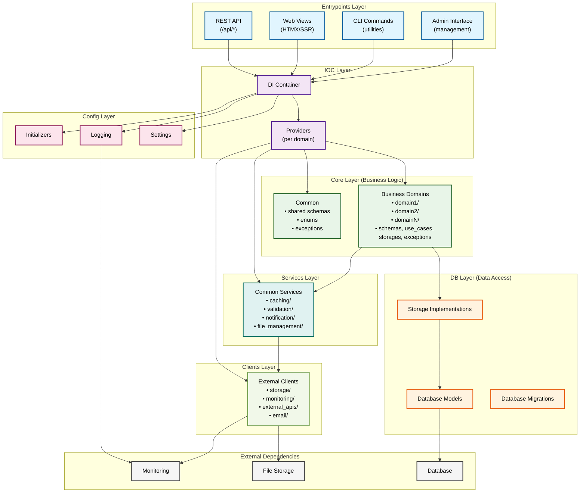
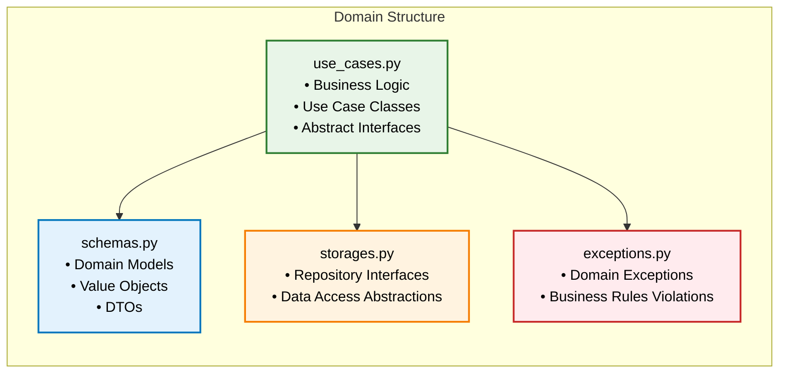
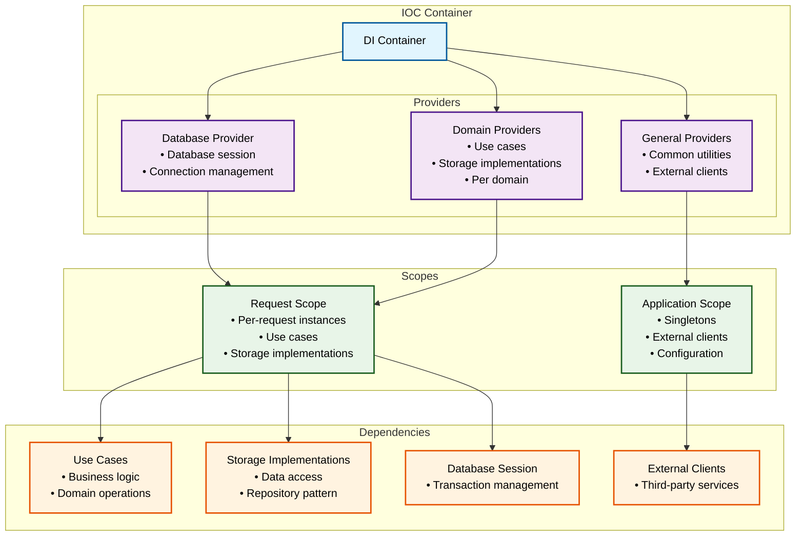
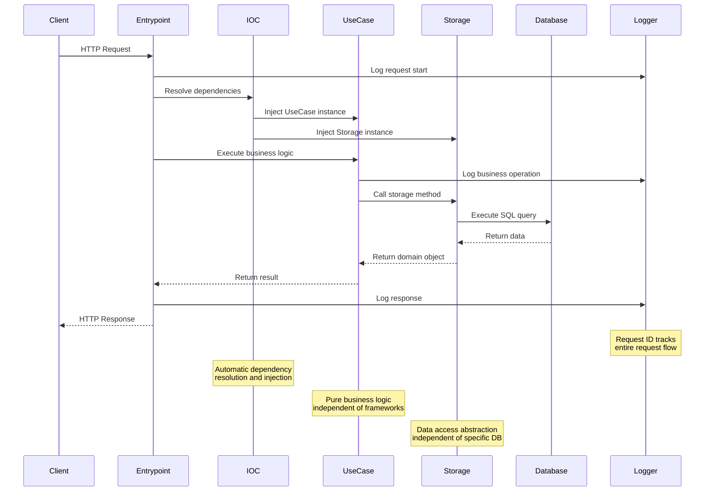

# ADR-002: Архитектура приложения

## Статус
Принято

## Контекст
Необходимо выбрать архитектурный подход для личного сайта-портфолио с блогом и интерактивной матрицей компетенций. Требования: демонстрация технических навыков, поддержка различных точек входа (API, HTMX views, CLI, Admin), чистота кода, тестируемость, масштабируемость.

**Альтернативы:**
- Монолитная архитектура — простота, но сложность поддержки и тестирования
- Микросервисная архитектура — избыточная сложность для личного проекта
- Layered Architecture — простота, но тесная связанность слоев
- MVC — устаревший подход, не подходит для современных веб-приложений

**Ключевые факторы выбора:**
- Чистота кода и разделение ответственности
- Независимость бизнес-логики от фреймворков и БД
- Тестируемость и простота разработки
- Демонстрация профессиональных навыков
- Готовность к расширению функциональности

## Решение
Принято решение использовать **Clean Architecture** с дополнительными принципами организации кода:

### Основные архитектурные принципы

1. **Clean Architecture** — разделение на слои с четкими границами
2. **Dependency Injection** — управление зависимостями через IOC контейнер
3. **Domain-Driven Design** — организация кода по бизнес-доменам
4. **Separation of Concerns** — четкое разделение ответственности
5. **Dependency Inversion** — зависимости направлены к центру архитектуры
6. **Dataclasses Only** — все самописные классы создаются через `@dataclass`
7. **Rich Domain Model** — бизнес-логика в методах доменных сущностей, Use Cases координируют взаимодействие

### Структура слоев

**1. Core Layer (src/core/)** — бизнес-логика и доменные модели
- **Назначение**: Содержит всю бизнес-логику, независимую от внешних зависимостей
- **Структура**: Организован по доменам (blog, competency_matrix, contacts, users)
- **Компоненты**: use_cases, schemas, exceptions, storages (абстракции)
- **Принципы**: Не зависит от фреймворков, БД, внешних сервисов

**2. DB Layer (src/db/)** — работа с данными
- **Назначение**: Реализация персистентности данных
- **Структура**: models, storages (реализации), migrations
- **Компоненты**: SQLAlchemy модели, репозитории, миграции Alembic
- **Принципы**: Зависит только от Core, реализует его абстракции

**3. Entrypoints Layer (src/entrypoints/)** — точки входа
- **Назначение**: Интерфейсы для взаимодействия с приложением
- **Структура**: litestar (API + HTMX), admin, CLI
- **Компоненты**: контроллеры, views, CLI команды, admin интерфейс
- **Принципы**: Зависит от Core, использует DI для получения зависимостей

**4. IOC Layer (src/ioc/)** — управление зависимостями
- **Назначение**: Централизованное управление зависимостями
- **Структура**: container, registry, providers
- **Компоненты**: Dishka контейнер, провайдеры для каждого домена
- **Принципы**: Связывает все слои, обеспечивает инверсию зависимостей

**5. Config Layer (src/config/)** — конфигурация приложения
- **Назначение**: Централизованная конфигурация и инициализация
- **Структура**: settings, loggers, initializers, constants
- **Компоненты**: Pydantic Settings, структурированное логирование
- **Принципы**: Используется всеми слоями, не зависит от других слоев

**6. Clients Layer (src/clients/)** — интеграции с внешними сервисами
- **Назначение**: Абстракция внешних API и сервисов
- **Структура**: Организован по типам клиентов (storage, monitoring, external_apis)
- **Компоненты**: HTTP клиенты, SDK обертки, адаптеры
- **Принципы**: Изолирует внешние зависимости, обеспечивает тестируемость

**7. Services Layer (src/services/)** — общие сервисы для use cases
- **Назначение**: Переиспользуемая бизнес-логика между доменами
- **Структура**: Организован по функциональности (caching, validation, notification)
- **Компоненты**: Сервисы, утилиты, хелперы
- **Принципы**: Не содержит доменной логики, используется use cases

### Организация по доменам

**Принцип Domain-Driven Design** применен в Core слое:

```
src/core/
├── domain1/                # Бизнес-домен 1
│   ├── schemas.py          # Доменные модели
│   ├── use_cases.py        # Бизнес-логика
│   ├── storages.py         # Абстракции репозиториев
│   ├── exceptions.py       # Доменные исключения
│   └── enums.py            # Доменные перечисления (опционально)
├── domain2/                # Бизнес-домен 2
├── domainN/                # Бизнес-домен N
├── schemas.py              # Общие доменные модели
├── enums.py                # Общие перечисления
└── exceptions.py           # Общие исключения
```

**Каждый домен содержит:**
- `schemas.py` — доменные модели (dataclasses) с бизнес-логикой
- `use_cases.py` — координация действий (UseCase классы)
- `storages.py` — абстракции репозиториев
- `exceptions.py` — доменные исключения
- `enums.py` — доменные перечисления (при необходимости)

### Rich Domain Model (Богатая доменная модель)

**Принцип**: Бизнес-логика должна находиться в методах доменных сущностей, а не в Use Cases или сервисах.

**Use Cases** — это координаторы, которые:
- Вызывают методы доменных сущностей
- Управляют последовательностью действий
- Интегрируют внешние сервисы
- НЕ содержат бизнес-логику

**Доменные сущности** содержат:
- Бизнес-правила и валидацию
- Методы для работы с данными
- Доменную логику
- Инкапсуляцию состояния

**Пример Rich Domain Model:**
```python
# src/core/domain/schemas.py
@dataclass(frozen=True, slots=True, kw_only=True)
class User:
    id: UUID
    email: str
    password_hash: str
    role: UserRole
    is_active: bool
    created_at: datetime
    last_login: datetime | None = None
    
    def can_login(self) -> bool:
        return self.is_active and self.role != UserRole.BANNED
    
    def can_access_admin(self) -> bool:
        return self.is_active and self.role in {UserRole.ADMIN, UserRole.SUPER_ADMIN}
    
    def update_last_login(self) -> "User":
        return User(
            id=self.id,
            email=self.email,
            password_hash=self.password_hash,
            role=self.role,
            is_active=self.is_active,
            created_at=self.created_at,
            last_login=datetime.utcnow(),
        )
    
    def change_password(self, new_password_hash: str) -> "User":
        if not self.is_active:
            raise UserInactiveError("Cannot change password for inactive user")
        
        return User(
            id=self.id,
            email=self.email,
            password_hash=new_password_hash,
            role=self.role,
            is_active=self.is_active,
            created_at=self.created_at,
            last_login=self.last_login,
        )
    
    def deactivate(self) -> "User":
        if self.role == UserRole.SUPER_ADMIN:
            raise CannotDeactivateSuperAdminError("Cannot deactivate super admin")
        
        return User(
            id=self.id,
            email=self.email,
            password_hash=self.password_hash,
            role=self.role,
            is_active=False,
            created_at=self.created_at,
            last_login=self.last_login,
        )

@dataclass(frozen=True, slots=True, kw_only=True)
class BlogPost:
    id: UUID
    title: str
    content: str
    slug: str
    author_id: UUID
    status: PublishStatus
    published_at: datetime | None = None
    tags: list[str] = field(default_factory=list)
    
    def can_be_published(self) -> bool:
        return (
            self.status == PublishStatus.DRAFT and
            len(self.title.strip()) > 0 and
            len(self.content.strip()) > 0 and
            len(self.slug.strip()) > 0
        )
    
    def publish(self) -> "BlogPost":
        if not self.can_be_published():
            raise CannotPublishPostError("Post cannot be published")
        
        return BlogPost(
            id=self.id,
            title=self.title,
            content=self.content,
            slug=self.slug,
            author_id=self.author_id,
            status=PublishStatus.PUBLISHED,
            published_at=datetime.utcnow(),
            tags=self.tags,
        )
    
    def add_tag(self, tag: str) -> "BlogPost":
        if not tag or not tag.strip():
            raise InvalidTagError("Tag cannot be empty")
        
        clean_tag = tag.strip().lower()
        if clean_tag in self.tags:
            return self  # Тег уже существует
        
        new_tags = list(self.tags) + [clean_tag]
        return BlogPost(
            id=self.id,
            title=self.title,
            content=self.content,
            slug=self.slug,
            author_id=self.author_id,
            status=self.status,
            published_at=self.published_at,
            tags=new_tags,
        )
    
    def is_published(self) -> bool:
        return self.status == PublishStatus.PUBLISHED
    
    def get_reading_time(self) -> int:
        words_per_minute = 200
        word_count = len(self.content.split())
        return max(1, word_count // words_per_minute)
```

**Use Cases как координаторы:**
```python
# src/core/domain/use_cases.py
@dataclass(kw_only=True)
class LoginUserUseCase:
    user_storage: UserStorage
    password_service: PasswordService
    token_service: TokenService
    logger: Logger
    
    async def execute(self, email: str, password: str) -> LoginResult:
        # 1. Получение пользователя через storage
        user = await self.user_storage.get_by_email(email)
        if not user:
            raise UserNotFoundError("User not found")
        
        # 2. Проверка возможности входа через метод доменной сущности
        if not user.can_login():
            raise UserCannotLoginError("User cannot login")
        
        # 3. Проверка пароля через сервис
        if not await self.password_service.verify_password(password, user.password_hash):
            raise InvalidPasswordError("Invalid password")
        
        # 4. Обновление времени последнего входа через метод доменной сущности
        updated_user = user.update_last_login()
        await self.user_storage.update(updated_user)
        
        # 5. Генерация токена через сервис
        token = await self.token_service.generate_token(updated_user.id)
        
        self.logger.info("User logged in successfully", user_id=user.id)
        return LoginResult(user=updated_user, token=token)

@dataclass(kw_only=True)
class PublishBlogPostUseCase:
    blog_storage: BlogStorage
    notification_service: NotificationService
    logger: Logger
    
    async def execute(self, post_id: UUID, author_id: UUID) -> BlogPost:
        # 1. Получение поста через storage
        post = await self.blog_storage.get_by_id(post_id)
        if not post:
            raise BlogPostNotFoundError("Post not found")
        
        # 2. Проверка прав автора (доменная логика)
        if post.author_id != author_id:
            raise UnauthorizedError("Only author can publish post")
        
        # 3. Публикация через метод доменной сущности
        if not post.can_be_published():
            raise CannotPublishPostError("Post cannot be published")
        
        published_post = post.publish()
        
        # 4. Сохранение через storage
        await self.blog_storage.update(published_post)
        
        # 5. Отправка уведомления через сервис
        await self.notification_service.send_post_published_notification(published_post)
        
        self.logger.info("Blog post published", post_id=post_id, author_id=author_id)
        return published_post

@dataclass(kw_only=True)
class FilterBlogPostsUseCase:
    blog_storage: BlogStorage
    logger: Logger
    
    async def execute(self, filters: BlogPostFilters) -> list[BlogPost]:
        # 1. Получение всех постов через storage
        all_posts = await self.blog_storage.get_all()
        
        # 2. Фильтрация через методы доменных сущностей
        filtered_posts = []
        for post in all_posts:
            if self._matches_filters(post, filters):
                filtered_posts.append(post)
        
        # 3. Сортировка через методы доменных сущностей
        filtered_posts.sort(key=lambda p: p.published_at or datetime.min, reverse=True)
        
        self.logger.info("Blog posts filtered", count=len(filtered_posts))
        return filtered_posts
    
    def _matches_filters(self, post: BlogPost, filters: BlogPostFilters) -> bool:
        # Используем методы доменной сущности для проверки
        if filters.only_published and not post.is_published():
            return False
        
        if filters.author_id and post.author_id != filters.author_id:
            return False
        
        if filters.tags:
            post_tags = set(post.tags)
            filter_tags = set(filters.tags)
            if not filter_tags.issubset(post_tags):
                return False
        
        return True
```

**Преимущества Rich Domain Model:**

1. **Инкапсуляция бизнес-логики** — правила находятся в самих сущностях
2. **Переиспользование** — методы можно использовать в разных Use Cases
3. **Тестируемость** — легко тестировать бизнес-логику в изоляции
4. **Читаемость** — код выражает намерения домена
5. **Безопасность** — невозможно нарушить бизнес-правила извне

**Правила Rich Domain Model:**

- ✅ **Бизнес-логика в методах сущностей**
- ✅ **Use Cases координируют действия**
- ✅ **Неизменяемые сущности** (frozen dataclasses)
- ✅ **Методы возвращают новые экземпляры**
- ❌ **НЕ хранить состояние в Use Cases**
- ❌ **НЕ дублировать бизнес-логику в разных местах**

### Dependency Injection архитектура

**IOC контейнер (Dishka)** связывает все слои:

```python
# src/ioc/registry.py
def get_providers() -> Iterable[Provider]:
    return (
        GeneralProvider(),           # Общие зависимости
        MinioProvider(),            # Файловое хранилище
        DatabaseProvider(),         # База данных
        Domain1Provider(),          # Домен 1
        Domain2Provider(),          # Домен 2
        DomainNProvider(),          # Домен N
    )
```

### Подробное описание Dependency Injection

**1. Контейнер и провайдеры**

IOC контейнер построен на основе библиотеки Dishka и состоит из:

```python
# src/ioc/container.py
from dishka import make_async_container
from ioc.registry import get_providers

# Создание асинхронного контейнера
container = make_async_container(*get_providers())
```

**2. Типы провайдеров**

**GeneralProvider** — общие утилиты и внешние клиенты:
```python
# src/ioc/providers/general_provider.py
class GeneralProvider(Provider):
    @provide(scope=Scope.APP)
    async def provide_uuid_generator(self) -> Callable[[], UUID]:
        return uuid.uuid4
    
    @provide(scope=Scope.APP)
    async def provide_minio_client(self) -> Minio:
        return Minio(
            endpoint=settings.minio.endpoint,
            access_key=settings.minio.access_key,
            secret_key=settings.minio.secret_key,
        )
```

**ClientsProvider** — внешние сервисы и API:
```python
# src/ioc/providers/clients_provider.py
class ClientsProvider(Provider):
    @provide(scope=Scope.APP)
    async def provide_storage_client(self) -> StorageClient:
        return MinioStorageClient(
            endpoint=settings.storage.endpoint,
            access_key=settings.storage.access_key,
            secret_key=settings.storage.secret_key,
        )
    
    @provide(scope=Scope.APP)
    async def provide_email_client(self) -> EmailClient:
        return SMTPEmailClient(
            host=settings.email.host,
            port=settings.email.port,
            username=settings.email.username,
            password=settings.email.password,
        )
    
    @provide(scope=Scope.APP)
    async def provide_monitoring_client(self) -> MonitoringClient:
        return SentryClient(dsn=settings.monitoring.sentry_dsn)
    
    @provide(scope=Scope.APP)
    async def provide_external_api_client(self) -> ExternalAPIClient:
        return HTTPAPIClient(
            base_url=settings.external_api.base_url,
            api_key=settings.external_api.api_key,
            timeout=settings.external_api.timeout,
        )
```

**ServicesProvider** — общие сервисы:
```python
# src/ioc/providers/services_provider.py
class ServicesProvider(Provider):
    @provide(scope=Scope.APP)
    async def provide_cache_service(self) -> CacheService:
        return RedisCacheService(
            host=settings.cache.redis_host,
            port=settings.cache.redis_port,
            db=settings.cache.redis_db,
        )
    
    @provide(scope=Scope.APP)
    async def provide_validation_service(self) -> ValidationService:
        return PydanticValidationService()
    
    @provide(scope=Scope.APP)
    async def provide_notification_service(
        self,
        email_client: EmailClient,
        logger: Logger,
    ) -> NotificationService:
        return EmailNotificationService(
            email_client=email_client,
            logger=logger,
        )
    
    @provide(scope=Scope.APP)
    async def provide_file_service(
        self,
        storage_client: StorageClient,
        logger: Logger,
    ) -> FileService:
        return FileManagementService(
            storage_client=storage_client,
            logger=logger,
        )
```

**DatabaseProvider** — управление подключением к БД:
```python
# src/ioc/providers/database_provider.py
class DatabaseProvider(Provider):
    @provide(scope=Scope.REQUEST)
    async def provide_database_session(self) -> AsyncSession:
        async with async_session_maker() as session:
            try:
                yield session
                await session.commit()
            except Exception:
                await session.rollback()
                raise
            finally:
                await session.close()
```

**DomainProvider** — провайдер для конкретного домена:
```python
# src/ioc/providers/domain_provider.py
class DomainProvider(Provider):
    @provide(scope=Scope.REQUEST)
    async def provide_domain_storage(
        self,
        session: AsyncSession,
    ) -> DomainStorage:
        return DomainDatabaseStorage(session=session)
    
    @provide(scope=Scope.REQUEST)
    async def provide_get_entity_use_case(
        self,
        storage: DomainStorage,
    ) -> AbstractGetEntityUseCase:
        return GetEntityUseCase(storage=storage)
    
    @provide(scope=Scope.REQUEST)
    async def provide_create_entity_use_case(
        self,
        storage: DomainStorage,
    ) -> AbstractCreateEntityUseCase:
        return CreateEntityUseCase(storage=storage)
```

**3. Scope'ы зависимостей**

**Scope.APP** — синглтоны на время жизни приложения:
- Внешние клиенты (MinIO, Sentry)
- Конфигурация
- Утилиты (генераторы UUID)
- Контекстные конвертеры

**Scope.REQUEST** — экземпляры на запрос:
- Use Cases
- Storage реализации
- Database сессии
- Временные объекты

**4. Автоматическое разрешение зависимостей**

Контейнер автоматически разрешает зависимости по типам:

```python
# Автоматическое разрешение цепочки зависимостей
@provide(scope=Scope.REQUEST)
async def provide_use_case(
    storage: DomainStorage,  # Автоматически инжектируется
    logger: Logger,          # Автоматически инжектируется
) -> AbstractUseCase:
    return ConcreteUseCase(storage=storage, logger=logger)
```

**5. Интеграция с Entrypoints**

**Litestar интеграция:**
```python
# src/entrypoints/litestar/lifespan.py
async def app_lifespan(app: Litestar) -> AsyncGenerator[None]:
    async with container() as request_container:
        app.state.dishka_container = request_container
        yield
    await app.state.dishka_container.close()
```

**Использование в контроллерах:**
```python
# src/entrypoints/litestar/api/domain/endpoints.py
@get("/entities/{entity_id:uuid}")
async def get_entity(
    entity_id: UUID,
    use_case: FromDishka[AbstractGetEntityUseCase],  # Автоматическая инжекция
) -> Entity:
    return await use_case.execute(entity_id)
```

**6. Управление жизненным циклом**

**Инициализация контейнера:**
```python
# src/main.py
def create_app() -> Litestar:
    return create_litestar(
        route_handlers=[api_router, views_router],
        lifespan=[app_lifespan],  # Управление жизненным циклом DI
    )
```

**Очистка ресурсов:**
```python
# Автоматическая очистка при завершении запроса
async def cleanup_request():
    await container.close()  # Закрытие всех REQUEST scope объектов
```

**7. Тестирование с DI**

**Мокирование зависимостей в тестах:**
```python
# tests/test_domain.py
async def test_use_case():
    # Создание тестового контейнера с моками
    test_container = make_async_container(
        TestGeneralProvider(),
        TestDomainProvider(),
    )
    
    async with test_container() as container:
        use_case = await container.get(AbstractUseCase)
        result = await use_case.execute(test_data)
        assert result is not None
```

**8. Принципы DI в проекте**

- **Инверсия зависимостей** — зависимости направлены к центру
- **Автоматическое разрешение** — контейнер сам находит нужные реализации
- **Типизация** — все зависимости строго типизированы
- **Scope управление** — четкое разделение жизненных циклов объектов
- **Тестируемость** — легкое мокирование для тестов

### Клиенты и сервисы

#### Clients Layer (src/clients/)

**Назначение**: Абстракция внешних API и сервисов для изоляции зависимостей.

**Структура клиентов:**
```
src/clients/
├── storage/                 # Файловые хранилища
│   ├── minio_client.py     # MinIO клиент
│   ├── s3_client.py        # AWS S3 клиент (альтернатива)
│   └── local_client.py     # Локальное хранилище (для dev)
├── monitoring/              # Мониторинг и логирование
│   ├── sentry_client.py    # Sentry клиент
│   ├── prometheus_client.py # Prometheus метрики
│   └── logger_client.py    # Структурированное логирование
├── external_apis/           # Внешние API
│   ├── payment_client.py   # Платежные системы
│   ├── notification_client.py # Уведомления
│   └── analytics_client.py # Аналитика
└── email/                   # Email сервисы
    ├── smtp_client.py      # SMTP клиент
    └── sendgrid_client.py  # SendGrid клиент
```

**Принципы клиентов:**
- **Абстракция** — все клиенты реализуют общие интерфейсы
- **Изоляция** — внешние зависимости не проникают в Core
- **Тестируемость** — легко мокируются для тестов
- **Конфигурируемость** — настройки через environment variables

**Пример клиента:**
```python
# src/clients/storage/storage_client.py
from abc import ABC, abstractmethod
from dataclasses import dataclass
from typing import BinaryIO

@dataclass(frozen=True, slots=True, kw_only=True)
class FileUploadResult:
    url: str
    bucket: str
    key: str
    size: int

class StorageClient(ABC):
    @abstractmethod
    async def upload_file(
        self,
        file_data: BinaryIO,
        bucket: str,
        key: str,
        content_type: str | None = None,
    ) -> FileUploadResult:
        raise NotImplementedError
    
    @abstractmethod
    async def delete_file(self, bucket: str, key: str) -> None:
        raise NotImplementedError
    
    @abstractmethod
    async def get_file_url(self, bucket: str, key: str) -> str:
        raise NotImplementedError

# src/clients/storage/minio_client.py
@dataclass(kw_only=True)
class MinioStorageClient(StorageClient):
    client: Minio
    logger: Logger
    
    async def upload_file(
        self,
        file_data: BinaryIO,
        bucket: str,
        key: str,
        content_type: str | None = None,
    ) -> FileUploadResult:
        self.logger.info("Uploading file", bucket=bucket, key=key)
        
        try:
            result = await self.client.put_object(
                bucket_name=bucket,
                object_name=key,
                data=file_data,
                content_type=content_type,
            )
            
            return FileUploadResult(
                url=f"/{bucket}/{key}",
                bucket=bucket,
                key=key,
                size=result.size,
            )
        except Exception as e:
            self.logger.error("Upload failed", error=str(e), bucket=bucket, key=key)
            raise StorageError("File upload failed") from e
```

#### Services Layer (src/services/)

**Назначение**: Переиспользуемые сервисы для use cases, не содержащие доменной логики.

**Структура сервисов:**
```
src/services/
├── caching/                 # Кэширование
│   ├── cache_service.py    # Основной сервис кэширования
│   ├── redis_service.py    # Redis реализация
│   └── memory_service.py   # In-memory кэш (для dev)
├── validation/              # Валидация данных
│   ├── validation_service.py # Основной сервис валидации
│   ├── pydantic_service.py  # Pydantic валидация
│   └── custom_validators.py # Кастомные валидаторы
├── notification/            # Уведомления
│   ├── notification_service.py # Основной сервис уведомлений
│   ├── email_service.py    # Email уведомления
│   └── sms_service.py      # SMS уведомления
├── file_management/         # Управление файлами
│   ├── file_service.py     # Основной сервис файлов
│   ├── image_processing.py # Обработка изображений
│   └── file_validation.py  # Валидация файлов
└── utilities/               # Утилиты
    ├── crypto_service.py   # Криптография
    ├── date_service.py     # Работа с датами
    └── string_service.py   # Работа со строками
```

**Принципы сервисов:**
- **Переиспользование** — используются в разных доменах
- **Без доменной логики** — только техническая функциональность
- **Инверсия зависимостей** — зависят от абстракций
- **Тестируемость** — легко тестируются в изоляции

**Пример сервиса:**
```python
# src/services/caching/cache_service.py
from abc import ABC, abstractmethod
from typing import Any, Optional
from dataclasses import dataclass

@dataclass(frozen=True, slots=True, kw_only=True)
class CacheConfig:
    default_ttl: int = 3600
    max_size: int = 1000
    compression: bool = True

class CacheService(ABC):
    @abstractmethod
    async def get(self, key: str) -> Any | None:
        raise NotImplementedError
    
    @abstractmethod
    async def set(self, key: str, value: Any, ttl: int | None = None) -> None:
        raise NotImplementedError
    
    @abstractmethod
    async def delete(self, key: str) -> None:
        raise NotImplementedError
    
    @abstractmethod
    async def clear(self) -> None:
        raise NotImplementedError

# src/services/caching/redis_service.py
@dataclass(kw_only=True)
class RedisCacheService(CacheService):
    redis_client: Redis
    config: CacheConfig
    logger: Logger
    
    async def get(self, key: str) -> Any | None:
        try:
            data = await self.redis_client.get(key)
            if data:
                self.logger.debug("Cache hit", key=key)
                return json.loads(data)
            return None
        except Exception as e:
            self.logger.warning("Cache get error", key=key, error=str(e))
            return None
    
    async def set(self, key: str, value: Any, ttl: int | None = None) -> None:
        try:
            ttl = ttl or self.config.default_ttl
            data = json.dumps(value)
            await self.redis_client.setex(key, ttl, data)
            self.logger.debug("Cache set", key=key, ttl=ttl)
        except Exception as e:
            self.logger.error("Cache set error", key=key, error=str(e))
            raise CacheError("Failed to set cache value") from e
```

#### Интеграция клиентов и сервисов с Use Cases

**Использование в Use Cases:**
```python
# src/core/domain/use_cases.py
@dataclass(kw_only=True)
class CreateEntityWithFileUseCase:
    storage: EntityStorage
    file_service: FileService
    cache_service: CacheService
    logger: Logger
    
    async def execute(self, data: CreateEntityData, file_data: bytes) -> Entity:
        self.logger.info("Creating entity with file", data_id=data.id)
        
        # Валидация файла
        file_info = await self.file_service.validate_file(file_data)
        if not file_info.is_valid:
            raise ValidationError("Invalid file")
        
        # Загрузка файла
        file_url = await self.file_service.upload_file(
            file_data=file_data,
            filename=file_info.filename,
            content_type=file_info.content_type,
        )
        
        # Создание сущности
        entity_data = data.model_copy(update={"file_url": file_url})
        entity = await self.storage.create(entity_data)
        
        # Кэширование результата
        await self.cache_service.set(
            key=f"entity:{entity.id}",
            value=entity.to_dict(),
            ttl=3600,
        )
        
        self.logger.info("Entity created successfully", entity_id=entity.id)
        return entity
```

**Провайдеры для клиентов и сервисов:**
```python
# src/ioc/providers/clients_provider.py
class ClientsProvider(Provider):
    @provide(scope=Scope.APP)
    async def provide_storage_client(
        self,
        logger: Logger,
    ) -> StorageClient:
        if settings.app.debug:
            return LocalStorageClient(logger=logger)
        else:
            return MinioStorageClient(
                client=Minio(
                    endpoint=settings.storage.endpoint,
                    access_key=settings.storage.access_key,
                    secret_key=settings.storage.secret_key,
                ),
                logger=logger,
            )
    
    @provide(scope=Scope.APP)
    async def provide_email_client(self) -> EmailClient:
        return SMTPEmailClient(
            host=settings.email.host,
            port=settings.email.port,
            username=settings.email.username,
            password=settings.email.password,
        )

# src/ioc/providers/services_provider.py
class ServicesProvider(Provider):
    @provide(scope=Scope.APP)
    async def provide_cache_service(
        self,
        redis_client: Redis,
        logger: Logger,
    ) -> CacheService:
        return RedisCacheService(
            redis_client=redis_client,
            config=CacheConfig(
                default_ttl=settings.cache.default_ttl,
                max_size=settings.cache.max_size,
            ),
            logger=logger,
        )
    
    @provide(scope=Scope.APP)
    async def provide_file_service(
        self,
        storage_client: StorageClient,
        logger: Logger,
    ) -> FileService:
        return FileManagementService(
            storage_client=storage_client,
            logger=logger,
        )
```

### Точки входа (Entrypoints)

**1. Web Application (src/entrypoints/web/)**
- **API endpoints** — REST API для внешних интеграций
- **HTMX views** — серверный рендеринг с динамикой
- **Middleware** — логирование, обработка ошибок

**2. CLI Application (src/entrypoints/cli/)**
- **CLI команды** — утилиты для администрирования
- **Отдельное приложение** — для CLI команд
- **Общий lifespan** — использует тот же контейнер

**3. Admin Interface (src/entrypoints/admin/)**
- **Admin интерфейс** — веб-интерфейс для управления БД
- **Автоматическая генерация** — формы на основе моделей
- **Интеграция с DI** — использует тот же контейнер

### Конфигурация и инициализация

**Централизованная конфигурация** в `src/config/`:

```python
# src/config/settings.py
class Settings:
    app: _AppSettings = _AppSettings()           # Настройки приложения
    auth: _AuthSettings = _AuthSettings()        # Настройки аутентификации
    database: _DatabaseSettings = _DatabaseSettings()  # Настройки БД
    storage: _StorageSettings = _StorageSettings()     # Настройки файлового хранилища
    monitoring: _MonitoringSettings = _MonitoringSettings()  # Настройки мониторинга
```

**Принципы конфигурации:**
- **Pydantic Settings** — валидация и типизация
- **Environment variables** — все настройки через env vars
- **Префиксы** — группировка по функциональности
- **Секреты** — использование SecretStr для чувствительных данных

## Последствия

### Положительные

**1. Чистота и читаемость кода**
- Четкое разделение ответственности между слоями
- Независимость бизнес-логики от внешних зависимостей
- Легкость понимания и навигации по коду

**2. Тестируемость**
- Бизнес-логика легко тестируется в изоляции
- Возможность мокирования зависимостей
- 100% покрытие Core слоя тестами

**3. Гибкость и расширяемость**
- Легкое добавление новых доменов
- Простое изменение реализаций (БД, внешние сервисы)
- Возможность добавления новых точек входа

**4. Демонстрация навыков**
- Показывает понимание современных архитектурных принципов
- Демонстрирует профессиональный подход к разработке
- Готовность к работе в команде

**5. Поддержка и развитие**
- Легкость внесения изменений
- Минимальное влияние изменений на другие части системы
- Простота добавления новой функциональности

### Отрицательные

**1. Сложность для простых задач**
- Избыточная структура для тривиальных операций
- Больше кода для простых CRUD операций
- Кривая обучения для новых разработчиков

**2. Производительность**
- Дополнительные слои абстракции
- Overhead от DI контейнера
- Больше объектов в памяти

**3. Время разработки**
- Больше времени на первоначальную настройку
- Необходимость создания множества файлов
- Сложность для быстрого прототипирования

## Альтернативы

### Рассмотренные варианты

#### 1. Монолитная архитектура
**Проблемы**:
- Тесная связанность компонентов
- Сложность тестирования
- Трудность масштабирования
- Нарушение принципа единственной ответственности

**Пример проблематичного кода**:
```python
# Плохо: бизнес-логика смешана с контроллером
@app.route("/api/posts")
def get_posts():
    posts = db.session.query(Post).all()  # Прямая работа с БД
    return jsonify([post.to_dict() for post in posts])  # Смешение с сериализацией
```

#### 2. Layered Architecture
**Проблемы**:
- Слои могут зависеть друг от друга
- Сложность изменения реализаций
- Нарушение принципа инверсии зависимостей
- Тесная связанность с конкретными технологиями

#### 3. MVC (Model-View-Controller)
**Проблемы**:
- Устаревший подход для современных приложений
- Смешение ответственности в контроллерах
- Сложность тестирования
- Не подходит для API и современных фреймворков

### Обоснование выбора Clean Architecture

#### Почему Clean Architecture?

**1. Независимость от фреймворков**
```python
# Бизнес-логика не зависит от конкретного фреймворка
@dataclass(kw_only=True)
class GetEntityUseCase(AbstractGetEntityUseCase):
    storage: EntityStorage  # Абстракция, не конкретная реализация
    
    async def execute(self, entity_id: UUID) -> Entity:
        entity = await self.storage.get_by_id(entity_id=entity_id)
        if not entity.is_available():
            raise EntityNotFoundError
        return entity
```

**2. Независимость от базы данных**
```python
# Можно легко заменить одну БД на другую
class EntityStorage(ABC):  # Абстракция
    @abstractmethod
    async def get_by_id(self, entity_id: UUID) -> Entity:
        raise NotImplementedError

class EntityDatabaseStorage(EntityStorage):  # Реализация для SQL БД
    # ...

class EntityMongoStorage(EntityStorage):  # Реализация для NoSQL БД
    # ...
```

**3. Независимость от UI**
```python
# REST API endpoint
@get("/api/entities/{entity_id:uuid}")
async def get_entity_api(
    entity_id: UUID,
    use_case: FromDishka[AbstractGetEntityUseCase],
) -> Entity:
    return await use_case.execute(entity_id)

# HTMX Web endpoint
@get("/entities/{entity_id:uuid}")
async def get_entity_web(
    entity_id: UUID,
    use_case: FromDishka[AbstractGetEntityUseCase],
) -> Template:
    entity = await use_case.execute(entity_id)
    return Template("entity/detail.html", context={"entity": entity})
```

#### Почему именно такая организация?

**1. Domain-Driven Design в Core слое**
- Естественная организация по бизнес-доменам
- Легкость понимания и навигации
- Возможность независимого развития доменов

**2. Dependency Injection через Dishka**
- Современный и мощный DI контейнер
- Поддержка async/await
- Автоматическое разрешение зависимостей
- Различные scope'ы для управления жизненным циклом

**3. Множественные точки входа**
- Гибкость в выборе интерфейса
- Возможность добавления новых типов клиентов
- Разделение ответственности между entrypoints

**4. Централизованная конфигурация**
- Единое место для всех настроек
- Типизация и валидация через Pydantic
- Простота управления окружениями

## Диаграммы архитектуры

### Общая схема слоев



### Структура домена



### Схема Dependency Injection



### Схема потока данных



## Реализация

### Структура проекта

```
src/
├── config/                 # Конфигурация и инициализация
│   ├── settings.py        # Настройки приложения
│   ├── loggers.py         # Конфигурация логирования
│   ├── initializers.py    # Инициализация компонентов
│   └── constants.py       # Константы
├── core/                  # Бизнес-логика (Clean Architecture)
│   ├── domain1/           # Бизнес-домен 1
│   ├── domain2/           # Бизнес-домен 2
│   ├── domainN/           # Бизнес-домен N
│   ├── schemas.py         # Общие доменные модели
│   ├── enums.py           # Общие перечисления
│   └── exceptions.py      # Общие исключения
├── clients/               # Внешние клиенты
│   ├── storage/           # Файловые хранилища
│   ├── monitoring/        # Мониторинг и логирование
│   ├── external_apis/     # Внешние API
│   └── email/             # Email сервисы
├── services/              # Общие сервисы
│   ├── caching/           # Кэширование
│   ├── validation/        # Валидация данных
│   ├── notification/      # Уведомления
│   ├── file_management/   # Управление файлами
│   └── utilities/         # Утилиты
├── db/                    # Работа с данными
│   ├── models/            # Модели базы данных
│   ├── storages/          # Реализации репозиториев
│   └── migrations/        # Миграции БД
├── entrypoints/           # Точки входа
│   ├── api/               # REST API endpoints
│   ├── web/               # Web views (HTMX/SSR)
│   ├── cli/               # CLI команды
│   └── admin/             # Admin интерфейс
├── ioc/                   # Dependency Injection
│   ├── container.py       # DI контейнер
│   ├── registry.py        # Регистрация провайдеров
│   └── providers/         # Провайдеры для каждого домена
├── static/                # Статические файлы
├── templates/             # HTML шаблоны
└── main.py                # Точка входа приложения
```

### Принципы взаимодействия слоев

**1. Направление зависимостей**
```
Entrypoints → Core ← DB
     ↓         ↑
    IOC → Config
```

- **Core** не зависит ни от чего
- **DB** зависит только от Core
- **Entrypoints** зависят от Core и используют DI
- **IOC** связывает все слои
- **Config** используется всеми слоями

**2. Инверсия зависимостей**
```python
# Хорошо: зависимость от абстракции
@dataclass(kw_only=True)
class GetEntityUseCase:
    storage: EntityStorage  # Абстракция

# Плохо: зависимость от конкретной реализации
@dataclass(kw_only=True)
class GetEntityUseCase:
    storage: EntityDatabaseStorage  # Конкретная реализация
```

**3. Управление зависимостями**
```python
# IOC контейнер автоматически разрешает зависимости
@provide(scope=Scope.REQUEST)
async def provide_get_entity_use_case(
    storage: EntityStorage,  # Автоматически инжектируется
) -> AbstractGetEntityUseCase:
    return GetEntityUseCase(storage=storage)
```

**4. Использование Dataclasses**
```python
# Все самописные классы создаются через @dataclass
@dataclass(kw_only=True)
class EntityUseCase:
    storage: EntityStorage  # Поля объявляются как атрибуты
    
    async def execute(self, entity_id: UUID) -> Entity:
        return await self.storage.get_by_id(entity_id)

# НЕ используется __init__:
class EntityUseCase:  # ❌ Неправильно
    def __init__(self, storage: EntityStorage):
        self.storage = storage
```

**5. Сложные примеры DI**

**Цепочка зависимостей:**
```python
# Use Case зависит от Storage и Logger
@dataclass(kw_only=True)
class ComplexUseCase:
    storage: EntityStorage
    logger: Logger
    validator: EntityValidator
    
    async def execute(self, data: EntityData) -> Entity:
        self.logger.info("Starting complex operation", data_id=data.id)
        
        # Валидация данных
        if not self.validator.validate(data):
            raise ValidationError("Invalid data")
        
        # Сохранение в БД
        entity = await self.storage.create(data)
        
        self.logger.info("Operation completed", entity_id=entity.id)
        return entity

# Провайдер автоматически разрешает все зависимости
@provide(scope=Scope.REQUEST)
async def provide_complex_use_case(
    storage: EntityStorage,      # Автоматически инжектируется
    logger: Logger,              # Автоматически инжектируется
    validator: EntityValidator,  # Автоматически инжектируется
) -> AbstractComplexUseCase:
    return ComplexUseCase(storage=storage, logger=logger, validator=validator)
```

**Условная инжекция:**
```python
# Разные реализации в зависимости от окружения
@provide(scope=Scope.APP)
async def provide_storage_client() -> StorageClient:
    if settings.app.debug:
        return MockStorageClient()  # Мок для разработки
    else:
        return RealStorageClient(  # Реальный клиент для production
            endpoint=settings.storage.endpoint,
            credentials=settings.storage.credentials,
        )
```

**Фабрика объектов:**
```python
# Создание объектов с параметрами
@provide(scope=Scope.REQUEST)
async def provide_entity_factory(
    session: AsyncSession,
    logger: Logger,
) -> EntityFactory:
    return EntityFactory(
        session=session,
        logger=logger,
        batch_size=settings.app.batch_size,
    )

# Использование фабрики
@dataclass(kw_only=True)
class EntityService:
    factory: EntityFactory
    
    async def create_batch(self, items: list[EntityData]) -> list[Entity]:
        return await self.factory.create_batch(items)
```

### Практические примеры DI

#### 1. Простая инжекция зависимостей

**Базовый Use Case:**
```python
# src/core/domain/use_cases.py
@dataclass(kw_only=True)
class GetEntityUseCase:
    storage: EntityStorage
    
    async def execute(self, entity_id: UUID) -> Entity:
        return await self.storage.get_by_id(entity_id)

# src/ioc/providers/domain_provider.py
@provide(scope=Scope.REQUEST)
async def provide_get_entity_use_case(
    storage: EntityStorage,
) -> AbstractGetEntityUseCase:
    return GetEntityUseCase(storage=storage)

# src/entrypoints/api/domain/endpoints.py
@get("/entities/{entity_id:uuid}")
async def get_entity(
    entity_id: UUID,
    use_case: FromDishka[AbstractGetEntityUseCase],
) -> Entity:
    return await use_case.execute(entity_id)
```

#### 2. Инжекция с дополнительными зависимостями

**Use Case с логированием и валидацией:**
```python
@dataclass(kw_only=True)
class CreateEntityUseCase:
    storage: EntityStorage
    logger: Logger
    validator: EntityValidator
    
    async def execute(self, data: CreateEntityData) -> Entity:
        self.logger.info("Creating entity", data=data)
        
        # Валидация
        if not self.validator.validate(data):
            raise ValidationError("Invalid entity data")
        
        # Создание
        entity = await self.storage.create(data)
        
        self.logger.info("Entity created", entity_id=entity.id)
        return entity

# Провайдер с множественными зависимостями
@provide(scope=Scope.REQUEST)
async def provide_create_entity_use_case(
    storage: EntityStorage,
    logger: Logger,
    validator: EntityValidator,
) -> AbstractCreateEntityUseCase:
    return CreateEntityUseCase(
        storage=storage,
        logger=logger,
        validator=validator,
    )
```

#### 3. Условная инжекция по окружению

**Разные реализации для dev/prod:**
```python
# src/ioc/providers/storage_provider.py
@provide(scope=Scope.APP)
async def provide_storage_client() -> StorageClient:
    if settings.app.debug:
        return MockStorageClient()
    else:
        return MinioStorageClient(
            endpoint=settings.storage.endpoint,
            access_key=settings.storage.access_key,
            secret_key=settings.storage.secret_key,
        )

# Использование в Use Case
@dataclass(kw_only=True)
class FileUploadUseCase:
    storage_client: StorageClient
    logger: Logger
    
    async def execute(self, file_data: bytes, filename: str) -> str:
        self.logger.info("Uploading file", filename=filename)
        
        file_url = await self.storage_client.upload(
            data=file_data,
            filename=filename,
        )
        
        self.logger.info("File uploaded", url=file_url)
        return file_url
```

#### 4. Фабрика объектов с DI

**Создание объектов с параметрами:**
```python
# src/core/domain/factories.py
@dataclass(kw_only=True)
class EntityFactory:
    session: AsyncSession
    logger: Logger
    batch_size: int
    
    async def create_batch(self, items: list[EntityData]) -> list[Entity]:
        self.logger.info("Creating batch", count=len(items))
        
        entities = []
        for i in range(0, len(items), self.batch_size):
            batch = items[i:i + self.batch_size]
            batch_entities = await self._create_batch(batch)
            entities.extend(batch_entities)
        
        return entities
    
    async def _create_batch(self, batch: list[EntityData]) -> list[Entity]:
        # Реализация создания батча
        pass

# Провайдер фабрики
@provide(scope=Scope.REQUEST)
async def provide_entity_factory(
    session: AsyncSession,
    logger: Logger,
) -> EntityFactory:
    return EntityFactory(
        session=session,
        logger=logger,
        batch_size=settings.app.batch_size,
    )
```

#### 5. Цепочка зависимостей

**Сложная цепочка с промежуточными сервисами:**
```python
# Промежуточный сервис
@dataclass(kw_only=True)
class EntityCacheService:
    cache_client: CacheClient
    logger: Logger
    
    async def get(self, key: str) -> Entity | None:
        cached = await self.cache_client.get(key)
        if cached:
            self.logger.debug("Cache hit", key=key)
            return Entity.from_dict(cached)
        return None
    
    async def set(self, key: str, entity: Entity, ttl: int = 3600) -> None:
        await self.cache_client.set(key, entity.to_dict(), ttl)
        self.logger.debug("Cache set", key=key, ttl=ttl)

# Use Case с кэшированием
@dataclass(kw_only=True)
class GetCachedEntityUseCase:
    storage: EntityStorage
    cache_service: EntityCacheService
    logger: Logger
    
    async def execute(self, entity_id: UUID) -> Entity:
        cache_key = f"entity:{entity_id}"
        
        # Попытка получить из кэша
        cached_entity = await self.cache_service.get(cache_key)
        if cached_entity:
            return cached_entity
        
        # Получение из БД
        entity = await self.storage.get_by_id(entity_id)
        
        # Сохранение в кэш
        await self.cache_service.set(cache_key, entity)
        
        return entity

# Провайдер с полной цепочкой
@provide(scope=Scope.REQUEST)
async def provide_get_cached_entity_use_case(
    storage: EntityStorage,
    cache_service: EntityCacheService,
    logger: Logger,
) -> AbstractGetCachedEntityUseCase:
    return GetCachedEntityUseCase(
        storage=storage,
        cache_service=cache_service,
        logger=logger,
    )
```

#### 6. Использование клиентов и сервисов

**Use Case с файловым сервисом:**
```python
@dataclass(kw_only=True)
class CreateEntityWithFileUseCase:
    storage: EntityStorage
    file_service: FileService
    cache_service: CacheService
    logger: Logger
    
    async def execute(self, data: CreateEntityData, file_data: bytes) -> Entity:
        self.logger.info("Creating entity with file", data_id=data.id)
        
        # Валидация файла через сервис
        file_info = await self.file_service.validate_file(file_data)
        if not file_info.is_valid:
            raise ValidationError("Invalid file format")
        
        # Загрузка файла через клиент
        file_url = await self.file_service.upload_file(
            file_data=file_data,
            filename=file_info.filename,
            content_type=file_info.content_type,
        )
        
        # Создание сущности
        entity_data = data.model_copy(update={"file_url": file_url})
        entity = await self.storage.create(entity_data)
        
        # Кэширование через сервис
        await self.cache_service.set(
            key=f"entity:{entity.id}",
            value=entity.to_dict(),
            ttl=3600,
        )
        
        return entity
```

**Use Case с уведомлениями:**
```python
@dataclass(kw_only=True)
class CreateEntityWithNotificationUseCase:
    storage: EntityStorage
    notification_service: NotificationService
    email_client: EmailClient
    logger: Logger
    
    async def execute(self, data: CreateEntityData) -> Entity:
        # Создание сущности
        entity = await self.storage.create(data)
        
        # Отправка уведомления
        await self.notification_service.send_notification(
            recipient=data.user_email,
            template="entity_created",
            context={"entity_id": entity.id, "entity_name": entity.name},
        )
        
        self.logger.info("Entity created and notification sent", entity_id=entity.id)
        return entity
```

#### 7. Тестирование с DI

**Мокирование зависимостей:**
```python
# tests/test_domain.py
class TestDomainProvider(Provider):
    @provide(scope=Scope.REQUEST)
    async def provide_mock_storage(self) -> EntityStorage:
        return Mock(spec=EntityStorage)
    
    @provide(scope=Scope.REQUEST)
    async def provide_mock_file_service(self) -> FileService:
        return Mock(spec=FileService)
    
    @provide(scope=Scope.REQUEST)
    async def provide_mock_cache_service(self) -> CacheService:
        return Mock(spec=CacheService)
    
    @provide(scope=Scope.REQUEST)
    async def provide_mock_logger(self) -> Logger:
        return Mock(spec=Logger)

async def test_use_case_with_services():
    # Создание тестового контейнера
    test_container = make_async_container(
        TestDomainProvider(),
        TestGeneralProvider(),
    )
    
    async with test_container() as container:
        use_case = await container.get(AbstractCreateEntityWithFileUseCase)
        
        # Настройка моков
        mock_storage = await container.get(EntityStorage)
        mock_file_service = await container.get(FileService)
        mock_cache_service = await container.get(CacheService)
        
        # Настройка поведения моков
        mock_file_service.validate_file.return_value = FileInfo(
            is_valid=True,
            filename="test.jpg",
            content_type="image/jpeg"
        )
        mock_file_service.upload_file.return_value = "https://storage.com/test.jpg"
        mock_storage.create.return_value = Entity(id=UUID("123"), name="test")
        
        # Тестирование
        result = await use_case.execute(
            data=CreateEntityData(name="test"),
            file_data=b"fake_image_data"
        )
        
        assert result.name == "test"
        mock_file_service.validate_file.assert_called_once()
        mock_file_service.upload_file.assert_called_once()
        mock_cache_service.set.assert_called_once()
```

#### 8. Примеры использования

##### Создание нового домена

**1. Создание Core компонентов**
```python
# src/core/domain/schemas.py
@dataclass(frozen=True, slots=True, kw_only=True)
class DomainEntity:
    id: UUID
    name: str
    description: str

# src/core/domain/use_cases.py
class AbstractGetDomainEntityUseCase(UseCase, ABC):
    @abstractmethod
    async def execute(self, entity_id: UUID) -> DomainEntity:
        raise NotImplementedError

@dataclass(kw_only=True)
class GetDomainEntityUseCase(AbstractGetDomainEntityUseCase):
    storage: DomainStorage
    
    async def execute(self, entity_id: UUID) -> DomainEntity:
        return await self.storage.get_by_id(entity_id)

# src/core/domain/storages.py
class DomainStorage(ABC):
    @abstractmethod
    async def get_by_id(self, entity_id: UUID) -> DomainEntity:
        raise NotImplementedError
```

**2. Создание DB реализации**
```python
# src/db/models/domain.py
class DomainEntityModel(Base, UUIDMixin):
    __tablename__ = "domain_entities"
    
    name: Mapped[str] = mapped_column(String(255))
    description: Mapped[str] = mapped_column(Text)
    
    def to_domain_schema(self) -> DomainEntity:
        return DomainEntity(
            id=self.id,
            name=self.name,
            description=self.description,
        )

# src/db/storages/domain.py
@dataclass(kw_only=True)
class DomainDatabaseStorage(DomainStorage):
    session: AsyncSession
    
    async def get_by_id(self, entity_id: UUID) -> DomainEntity:
        query = select(DomainEntityModel).where(DomainEntityModel.id == entity_id)
        model = await self.session.scalar(query)
        if model is None:
            raise DomainEntityNotFoundError
        return model.to_domain_schema()
```

**3. Создание IOC провайдера**
```python
# src/ioc/providers/domain_provider.py
class DomainProvider(Provider):
    @provide(scope=Scope.REQUEST)
    async def provide_domain_storage(
        self,
        session: AsyncSession,
    ) -> DomainStorage:
        return DomainDatabaseStorage(session=session)
    
    @provide(scope=Scope.REQUEST)
    async def provide_get_domain_entity_use_case(
        self,
        storage: DomainStorage,
    ) -> AbstractGetDomainEntityUseCase:
        return GetDomainEntityUseCase(storage=storage)
```

**4. Создание Entrypoint**
```python
# src/entrypoints/api/domain/endpoints.py
@get("/domain/{entity_id:uuid}")
async def get_domain_entity(
    entity_id: UUID,
    use_case: FromDishka[AbstractGetDomainEntityUseCase],
) -> DomainEntity:
    return await use_case.execute(entity_id)
```

#### Добавление новой точки входа

**1. Создание нового entrypoint**
```python
# src/entrypoints/new_entrypoint/initializers.py
def create_new_entrypoint_app() -> SomeFramework:
    app = SomeFramework()
    setup_di_container(container=container, app=app)
    return app
```

**2. Регистрация в main.py**
```python
# src/main.py
def create_new_app() -> SomeFramework:
    return create_new_entrypoint_app()
```

## Заключение

Выбранная архитектура обеспечивает:

1. **Чистоту кода** — четкое разделение ответственности
2. **Тестируемость** — легкое тестирование в изоляции
3. **Гибкость** — простое добавление новой функциональности
4. **Демонстрацию навыков** — современные архитектурные принципы
5. **Готовность к развитию** — масштабируемость и поддерживаемость

Архитектура идеально подходит для портфолио-проекта, демонстрируя профессиональный подход к разработке и готовность к работе в команде.
